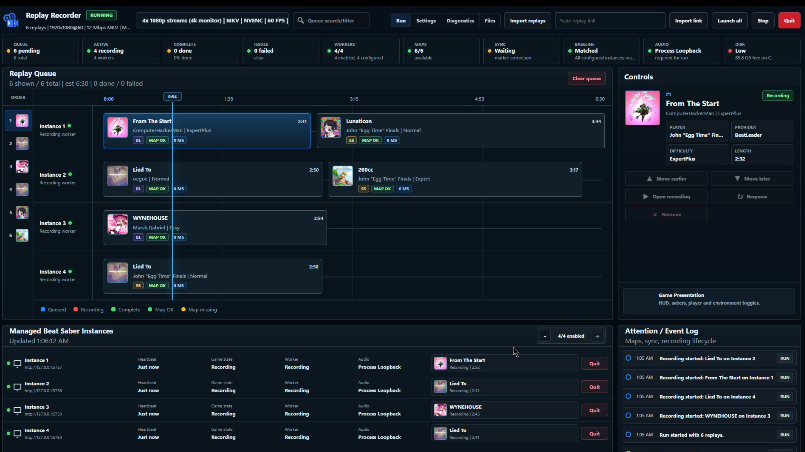

# Beat Saber Auto Replay Recorder


Logo by Stenis


Replay Recorder is a local Windows desktop app for turning BeatLeader and ScoreSaber replays into finished Beat Saber videos.

## Tested on verions 1.40.6, 1.44.1

It launches one or more managed Beat Saber worker copies, plays queued replays, records each game window, captures audio from the matching Beat Saber process, sync-corrects the result, and saves the final video to your recorder workspace.

The normal path is intentionally simple:

1. Download the Windows portable ZIP from [GitHub Releases](https://github.com/JustinMDigital/bs-replay-recorder/releases).
2. Extract the entire folder somewhere writable, such as `C:\ReplayRecorder`.
3. Open the top-level `Replay Recorder.exe` from the extracted folder.
4. Complete the five-step setup inside the app.
5. Import replay files or replay links, then press `Start run`.
6. Pick up videos from `ControlPanelWorkspace\Recordings`.

 

This recorder does not use OBS, obs-websocket, VB-CABLE, or BSManager in the normal runtime path.

## What It Handles

- BeatLeader `.bsor` files.
- BeatLeader score and replay links.
- ScoreSaber replay `.dat` files.
- ScoreSaber replay links.
- Multiple managed Beat Saber workers for parallel recording.
- Queue editing, retries, saved map collections, and collection map-card export.
- Shared map and custom-content folders across managed workers.
- Process-specific audio capture through ProcessLoopback.
- Automatic sync marker analysis before a recording is accepted.

## Requirements

- Windows.
- A local PC Beat Saber install.
- BSIPA and BeatLeader installed in the Beat Saber folder used as the worker template.
- ScoreSaber in that same source folder if you want ScoreSaber replay playback.
- An NVIDIA GPU with NVENC and a current NVIDIA driver. The default recorder profile uses NVENC H.264.
- No .NET install is required for the packaged release. The source-tree development path still uses the .NET 10 SDK.
- FFmpeg and ffprobe. The installer can detect common installs, offer WinGet install for `Gyan.FFmpeg`, or save a custom path.
- Node.js and npm only when developing or rebuilding the Electron desktop package.
- Optional: `tools\SetDpi\SetDpi.exe` or `BSARR_SETDPI_PATH` if you use presets that temporarily change Windows display scaling.

The default plugin manifest targets Beat Saber `1.40.6`, BSIPA `^4.3.6`, and BeatLeader `^0.9.33`. The plugin can be built against another Beat Saber folder/version when needed.

## First Setup

The release is portable, so there is no traditional Windows installer. Extract the whole ZIP before opening it, and keep `Replay Recorder.exe` beside the included `dist`, `scripts`, and `Support` folders. The EXE is the launcher, not a standalone file.

On the first launch, the app walks through five steps:

1. **Beat Saber:** choose a detected Steam or Meta PC install, or enter the folder containing `Beat Saber.exe`. The selected game must already have BSIPA and BeatLeader installed. Replay Recorder uses it as a template and does not modify your normal game folder.
2. **Recording display:** choose the monitor to capture. Setup starts with one 1080p worker; more workers and other quality profiles can be added later.
3. **FFmpeg:** use the detected install, install `Gyan.FFmpeg` through WinGet, or enter the full path to `ffmpeg.exe`. `ffprobe.exe` must be in the same install.
4. **Recorder worker:** create a separate managed Beat Saber copy under `ControlPanelWorkspace\Instances`.
5. **Test capture:** run a short preflight that checks the selected monitor, FFmpeg, NVENC encoder, and NVIDIA driver.

When the test passes, choose `Go to recorder`, import a replay, and start the run. Setup creates local settings and only the missing managed-worker files; it does not copy personal settings, replays, or recordings into the release defaults.

`Support\install.bat` is not part of the normal release install flow. Use it only when working from a source checkout or repairing an extracted package:

From the repo root:

```bat
Support\install.bat
```

The installer creates a local `settings.json` from `settings.example.json` if needed. Keep machine-specific paths in `settings.json`; it is ignored by git.

During source/repair setup, the installer may ask for:

- an FFmpeg path, or permission to install FFmpeg with WinGet;
- the Beat Saber source folder to copy/build against;
- how many managed worker copies to create;
- whether to download or use a display scaling helper;
- whether to import existing songs into the recorder's shared-song layout.

For a first test, one worker is the calmest option. After that, increase the instance count if the machine can handle parallel captures.

## Daily Use

Start the app:

```bat
Replay Recorder.exe
```

The desktop window starts the local recorder stack and opens the control panel. The same UI is also available for debugging at:

```text
http://127.0.0.1:5770
```

In the control panel:

1. Check `Files` if you want to confirm the workspace, output folder, managed instances, and shared folders.
2. Use `Settings` to pick the recording monitor, feed preset, capture quality, audio behavior, and worker count.
3. Use `Diagnostics` -> `Launch + Verify` when you want the app to launch workers and prove they are ready.
4. Use `Run` to import replay files or links, save/load collections, and start the queue.
5. Open completed recordings from the queue details, or browse `ControlPanelWorkspace\Recordings`.

Close `Replay Recorder.exe` when you are done. Closing the window stops the recorder stack and tracked Beat Saber workers. From a terminal, the equivalent cleanup command is:

```powershell
scripts\launcher\Stop-ReplayRecorder.ps1 -StopGames
```

The control panel also has an idle shutdown timer. By default it stops the stack after 20 minutes with no run activity. Change `idleShutdownMinutes` in `settings.json`, or set it to `0` to disable that behavior.

## Project Shape

The repo is split into a few clear pieces:

- `src/BSAutoReplayRecorder.ControlPanel` is the local web dashboard and API. It owns settings, queue state, collections, worker launch, readiness checks, and run progress.
- `src/BSAutoReplayRecorder.Plugin` is the BSIPA worker plugin installed into each managed Beat Saber copy. It receives one replay assignment at a time and reports results back to the panel.
- `src/BSAutoReplayRecorder.RecorderHost` is the local capture service. It runs FFmpeg, captures ProcessLoopback audio, trims/muxes output, and writes sync metadata.
- `src/BSAutoReplayRecorder.Core` contains shared queue, replay, and recording models.
- `src/BSAutoReplayRecorder.DesktopHost`, `src/BSAutoReplayRecorder.RootLauncher`, and `electron/` make the packaged desktop experience.
- `tools/` contains capture/helper utilities such as Windows Graphics Capture, ProcessLoopback wrappers, audio capture support, and metadata tools.
- `scripts/` contains install, launch, display, build, and packaging helpers.
- `tests/` contains lightweight .NET harnesses for core, control-panel, and recorder-host behavior.

The app is control-panel-first: the queue lives in the dashboard, not in the Beat Saber plugin.

## Local Files

The default workspace is:

```text
ControlPanelWorkspace/
  Queue/
  Collections/
  Logs/
  Recordings/
  Instances/
  SharedSongs/
  SharedContent/
  control-panel-state.json
  recorder-host-5757.settings.json
```

These folders are runtime state, not source. They are ignored by git.

The packaged desktop build has a few layers:

- `dist/runtime` contains the published .NET runtime pieces.
- `dist/electron/win-unpacked` contains the Electron app.
- the root `Replay Recorder.exe` is the launcher you double-click.

Run this when you need to refresh the packaged desktop app:

```powershell
npm run electron:pack
```

## Useful Commands

Install or repair the local setup:

```bat
Support\install.bat
```

Start through the support script:

```bat
Support\start.bat
```

Stop everything the recorder launched:

```bat
Support\stop.bat
```

Run the main control-panel test harness:

```powershell
dotnet run --project tests\BSAutoReplayRecorder.ControlPanel.Tests\BSAutoReplayRecorder.ControlPanel.Tests.csproj
```

Probe the live control panel:

```powershell
curl.exe http://127.0.0.1:5770/api/state
```

## Notes And Troubleshooting

- Managed Beat Saber workers are separate local copies. Do not point the managed instance root at your everyday Beat Saber install.
- The current FFmpeg desktop capture path can record overlays drawn over the capture region. Keep notifications, Steam overlays, Discord overlays, and other popups away from the recording area.
- ProcessLoopback audio is process-specific, so unrelated desktop sounds should not be mixed into the recording.
- If FFmpeg is missing, use `Install FFmpeg` in first-run setup or set `ffmpegPath` in Advanced Settings. The folder with `ffmpeg.exe` should also contain `ffprobe.exe`.
- If workers do not connect, use `Diagnostics` -> `Launch + Verify` before changing settings by hand.
- If maps are missing, use the queue item's map download/upload action or run shared-folder repair from `Files`.
- If sync cannot be proven, the replay should fail instead of producing a questionable recording. Check the queue details and the adjacent `*.sync.json` file.

## More Detail

- Control panel guide: `src/BSAutoReplayRecorder.ControlPanel/README.md`
- Worker plugin guide: `src/BSAutoReplayRecorder.Plugin/README.md`
- Recorder host guide: `src/BSAutoReplayRecorder.RecorderHost/README.md`
